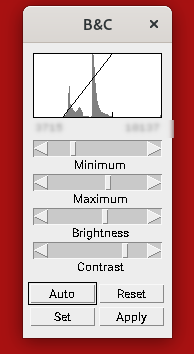

# Lab 2 -- Image Analysis Using ImageJ/Fiji

## Introduction

## Preliminaries

We'll use ImageJ/Fiji this week again. Make sure it is installed. [See last week's lab if it isn't](../Lab-01). We will initially use the same image as last week.

## Area Measurements of an object

1. Download [DX000000](https://github.com/effepivi/ICE-3111-Computer_Vision/raw/main/Labs/Lab-01/DX000000).
2. Open `DX000000` via `File → Open`.

3. I don't know you, but I find the image a bit dull.  
    - The dynamic range of the image is [0 - 16383], with 0 the smallest pixel value in the image; and 16383 the largest one.

    

    - Why 16383?
        - 16 bits are used to store a pixel value.
        - $2^16 = 65536$
        - However, only 14 bits are needed for X-ray radiographs.
        - $2^14 = 16384$
        - The largest value using 14 bits is 16383.
    - In the histograms you computed last week, we visualised the distribution of pixel values in a graph:

    

    - A lot of the dynamic range is not actually conveying meaningful information:
        - See the tails of the histogram.

        

        - The important information is
        important in the middle of the range:

        

    - To improve the brightness/contrast of the image we see, we'd like to limit the visualisation to that range:
        - Go to the menu `Image->Adjust->Brightness/Contrast`.
        - A dialogue box ("B&C") will appear. By default the pixel values are rescaled so that the whole dynamic range [0 - 16383] is displayed on the computor monitor that only supports 256 grey levels.

        

        - Adjust the "Minimum" and "Maximum" values to something like:

        

        - The image looks like this:

        

3. Open your lab report from last week. What was the width and height of the PMMA block?
    - in mm, and
    - in pixels.
4. What is the area of the entire PMMA block in $mm^2$?
