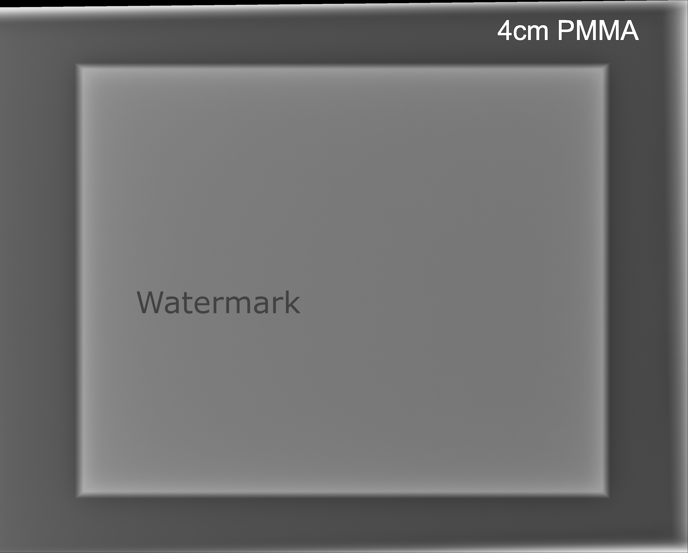
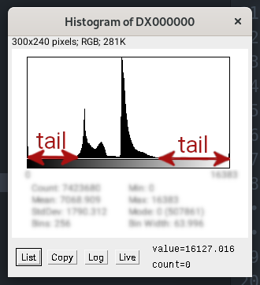
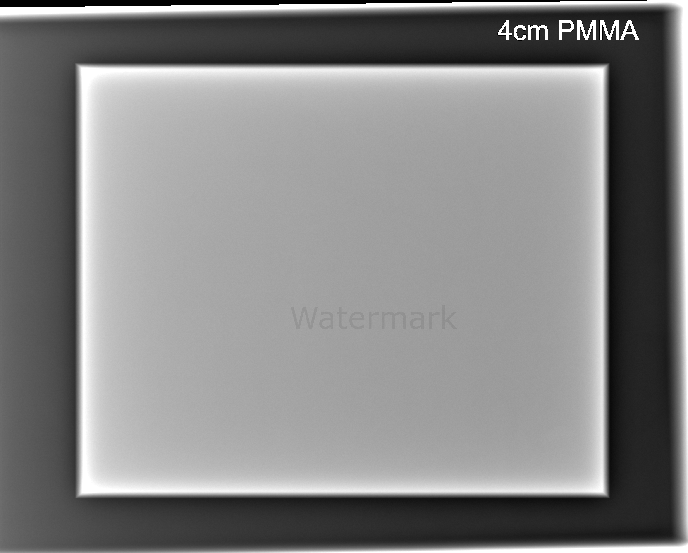
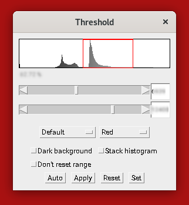

# Lab 2 -- Image Analysis Using ImageJ/Fiji

- (worth 5% of Assignment 1)
- Deadline: 13/10/2021 at 23:59
- Write your answers in the template provided: [questionnaire.docx](questionnaire.docx)

## Introduction

This week you heard of sampling and quantisation in the lecture. We saw that the data type used to store pixel values is important in order to retain information. This is true with the two images will use today. One is in UINT16, one in FLOAT32.

Today we will:

- Adjust the brightness and contrast of images so that they look nice to use, but without changing the actual pixel values.
- Segment (in other word select regions of interest) parts of the image to measure their areas.

## Preliminaries

We'll use ImageJ/Fiji this week again. Make sure it is installed. [See last week's lab if it isn't](../Lab-01). We will initially use the same image as last week.

## Improving the Brightness and Contrast of the Visualisation

**NOTE: none of the actions that we perform in this section will change the pixel data. We are only tweaking the visualisation of the image.**

1. Download [DX000000](https://github.com/effepivi/ICE-3111-Computer_Vision/raw/main/Labs/Lab-01/DX000000).
2. Open `DX000000` via `File → Open`.

3. I don't know you, but I find the image a bit dull.  
    - The dynamic range of the image is [0 - 16383], with 0 the smallest pixel value in the image; and 16383 the largest one.

    

    - Why 16383?
        - 16 bits are used to store a pixel value.
        - $2^16 = 65536$
        - However, only 14 bits are needed for X-ray radiographs.
        - $2^14 = 16384$
        - The largest value using 14 bits is 16383.
    - In the histograms you computed last week, we visualised the distribution of pixel values in a graph:

    

    - A lot of the dynamic range is not actually conveying meaningful information:
        - See the tails of the histogram.

        

        - The important information is
        important in the middle of the range:

        

    - To improve the brightness/contrast of the image we see, we'd like to limit the visualisation to that range:
        - Go to the menu `Image->Adjust->Brightness/Contrast`.
        - A dialogue box ("B&C") will appear. By default the pixel values are rescaled so that the whole dynamic range [0 - 16383] is displayed on the computor monitor that only supports 256 grey levels.

        

        - Adjust the "Minimum" and "Maximum" values to something like:

        

        - The image looks like this:

        

        - Once you're happy with the brightness/contrast, shut the window. **DO NOT CLICK ON `Apply` AS IT WILL CHANGE THE PIXEL VALUES.**
4. How does it work?
    - ImageJ holds two copies of the image. One is the original data, in its native format: It is the one used for calculations. The other one is in UINT8 for the visualisation: This is the one displayed on the screen.
    - Let's call the original image  and the visualisation image .

    

    with:
    
        - , for black
        - , for white
        - 
        - 
    - Any value below  will be black, and any value above  will be white.

## Area Measurements of an Object

1. Open your lab report from last week. What was the width and height of the PMMA block?
    - in mm, and
    - in pixels.
2. What is the area of the entire PMMA block in mm2?
    - Tip: Assume the object is a rectangle. 
3. Look at your histograms from last week's report.
    - What was the max pixel value of the background?
    - What was the min pixel value of the PMMA block?
    - What is the pixel value in the middle?
        - Tip: 
        - Write down this number, we'll use it as a "threshold" that will separate the PMMA block from its background.
4. Go to the menu `Image->Adjust->Threshold`.
    - A dialogue box ("Threshold") will appear.

    

    - In the textbox at the top, input the number you just wrote down.
    - In the textbox just below, input the max pixel value of the image (16383).

    You should have something like:

    

    And the image looks like:

    
5. The problem is that the text "4cm PMMA" has been selected. It's wrong!
    - Adjust the upper threshold with the corresponding slider so that this text does not show up in red.
    - Add a screenshot of the image in your lab report.
6. Below the histogram in the threshold dialog box, you see a percentage. This is the percentage of pixels of the image that is in red.
    - What is it?
7. Estimate the size of the PMMA block in mm2 using this percentage.
    - Tip: 
8. How does it compare with your previous estimation?
    - Tip: 
    - If the error is greater than 0, then the area is overestimated. If it is lower, it is underestimated.

**NOTE:** For a rectangle, we can easily compute the area with , and this is what we did. However, for complex shapes, this method is not possible and we must use the alternative method we just tried (even if it may not be as accurate, this is a trade-off).

## Simulated microtomography of a tungsten fibre

1. Download the file [perfect_CT.tif](perfect_CT.tif).
2. Open the file.
3. As you may see the data type is FLOAT32. The image is a simulated microtomography slice of a tungsten fibre. I use it in my research. There is no limit to what the pixel values can be, which is why floating point numbers are necessary. The smallest pixel value is negative, and the largest is 341.61.
4. Adjust the brightness and contrast so that the image looks nice. Add a screenshot in your lab report.
    - The bright circles correspond to tungsten (W) cores.
    - The dark circles correspond to silicon carbide (SiC).
    - The rectangular structure (called matrix) is an titanium/aluminium/vanadium alloy (Ti90Al6V4).
5. Adjust the size of pixel.
    - Go to the menu: `Image -> Properties`
    - Change both the pixel width and height to `1.9`
    - Change the units to `um`.

    
6. With the line selection tool ,
    - measure the diameter in um of one of the bright circles,
    - measure the diameter in um of one of the dark circles,
    - measure the width and height in um of the rectangular structure.
7. What is the percentage of the pixels of the image that corresponds to
    - tungsten
    - silicon carbide, and
    - titanium/aluminium/vanadium alloy.
    - Tip: Use the Threshold dialog box, fiddle with the sliders, note the percentage and compute the area in um2 as we did before.
