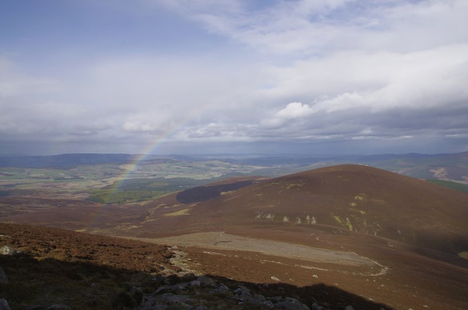
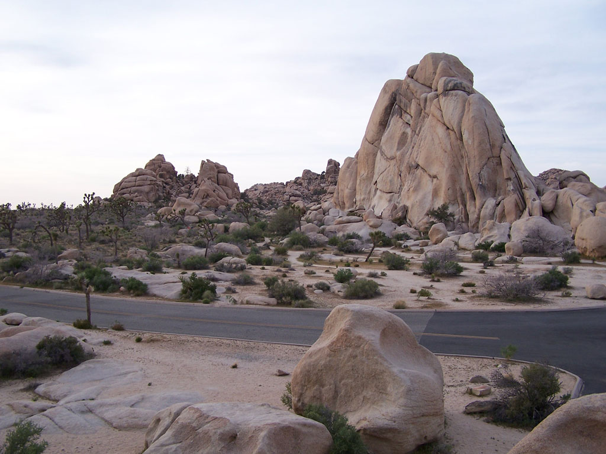
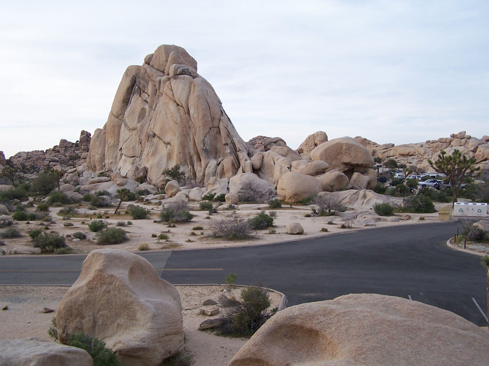

# Lab 8 -- Panorama stitching using OpenCV's Feature Detection and Tracking Framework

- (worth 50% of Assignment 2)
- Deadline: 15/12/2021 at 23:59
- Write your answers in the template provided: [questionnaire.docx](https://github.com/effepivi/ICE-3111-Computer_Vision/raw/main/Labs/Lab-08/questionnaire.docx)

This lab relies on the lectures of:
  - Week 9 on Feature Detection and Tracking, and
  - Week 10 on Transformations and Panoramas.

This is the last lab of the year

# Test images

There are 2 sets of image files to test your code:

<!-- - The first set has only two images [left-1.jpg](left-1.jpg) and [right-1.jpg](right-1.jpg):

| Left image | Right image |
|------------|-------------|
|  |  | -->

- The first set has only two images [left-2.jpg](left-2.jpg) and [right-2.jpg](right-2.jpg):

| Left image | Right image |
|------------|-------------|
|  |  |

- The second set has three images [left-3.jpg](left-3.jpg), [middle-3.jpg](middle-3.jpg) and [right-3.jpg](right-3.jpg):

| Left image | Middle image | Right image |
|------------|--------------|-------------|
|  |  |  |

You can of course use your own images. **You are in fact strongly advised to use your own pictures**. Marks will be allocated for testing. Moreover, it's always more fun to see the results using your own images. My advise is to take landscape images where there is not much in the foreground.

# Instructions

- [Click here for instructions in C/C++](C-CXX.md)
- [Click here for instructions in Python](Python.md)

# Don't forget

To complete the lab report and to submit it.
